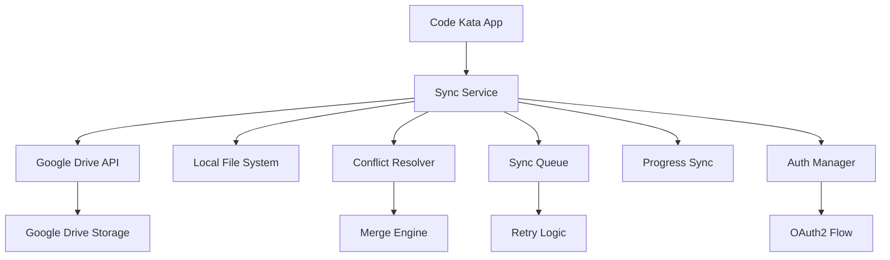
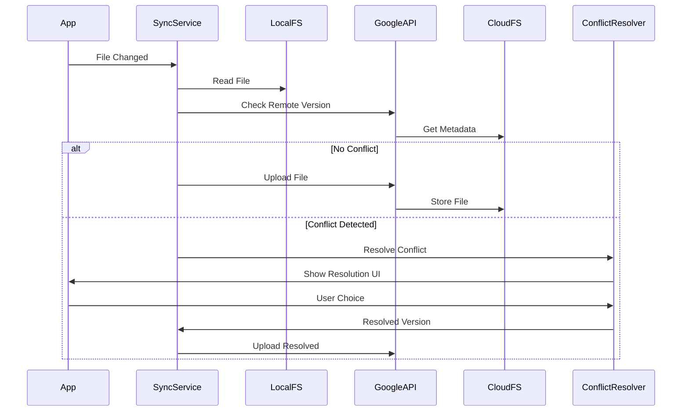

# Design Document

## Overview

The Cloud Kata Sync system is an integrated feature within the Code Kata Electron App that provides bidirectional synchronization of katas, progress data, and user content with Google Drive. The system maintains a local-first approach while providing seamless cloud backup and multi-device access through Google Drive API integration.

## Architecture

### High-Level Architecture



### Sync Architecture



## Components and Interfaces

### Frontend Components

#### 1. Sync Settings Panel
```typescript
interface SyncSettingsPanelProps {
  syncConfig: SyncConfiguration;
  connectionStatus: ConnectionStatus;
  onConnect: () => void;
  onDisconnect: () => void;
  onConfigChange: (config: Partial<SyncConfiguration>) => void;
}

interface SyncConfiguration {
  enabled: boolean;
  syncKatas: boolean;
  syncProgress: boolean;
  syncSettings: boolean;
  autoSync: boolean;
  syncIntervalMinutes: number;
  conflictResolution: 'ask' | 'local' | 'remote' | 'merge';
}
```

#### 2. Sync Status Indicator
```typescript
interface SyncStatusProps {
  status: SyncStatus;
  lastSync: Date | null;
  pendingOperations: number;
  onShowDetails: () => void;
}

interface SyncStatus {
  state: 'idle' | 'syncing' | 'error' | 'offline' | 'disabled';
  message: string;
  progress?: number;
}
```

#### 3. Conflict Resolution Dialog
```typescript
interface ConflictResolutionProps {
  conflict: SyncConflict;
  onResolve: (resolution: ConflictResolution) => void;
  onCancel: () => void;
}

interface SyncConflict {
  filePath: string;
  localVersion: FileVersion;
  remoteVersion: FileVersion;
  conflictType: 'content' | 'metadata' | 'deletion';
}

interface ConflictResolution {
  action: 'use_local' | 'use_remote' | 'merge' | 'keep_both';
  mergedContent?: string;
}
```

#### 4. Sync History Panel
```typescript
interface SyncHistoryProps {
  history: SyncOperation[];
  onRetry: (operationId: string) => void;
  onClearHistory: () => void;
}

interface SyncOperation {
  id: string;
  timestamp: Date;
  type: 'upload' | 'download' | 'delete' | 'conflict';
  filePath: string;
  status: 'success' | 'failed' | 'pending';
  error?: string;
}
```

### Backend Services

#### 1. Cloud Sync Service
```typescript
interface CloudSyncService {
  connect(): Promise<void>;
  disconnect(): Promise<void>;
  isConnected(): boolean;
  syncAll(): Promise<SyncResult>;
  syncFile(filePath: string): Promise<void>;
  downloadFile(cloudPath: string): Promise<void>;
  uploadFile(localPath: string): Promise<void>;
  deleteFile(filePath: string): Promise<void>;
  getConnectionStatus(): ConnectionStatus;
}

interface SyncResult {
  uploaded: number;
  downloaded: number;
  conflicts: number;
  errors: SyncError[];
}
```

#### 2. Google Drive API Service
```typescript
interface GoogleDriveService {
  authenticate(): Promise<AuthResult>;
  refreshToken(): Promise<void>;
  createFolder(name: string, parentId?: string): Promise<string>;
  uploadFile(filePath: string, content: Buffer, parentId?: string): Promise<DriveFile>;
  downloadFile(fileId: string): Promise<Buffer>;
  listFiles(parentId?: string): Promise<DriveFile[]>;
  updateFile(fileId: string, content: Buffer): Promise<DriveFile>;
  deleteFile(fileId: string): Promise<void>;
  getFileMetadata(fileId: string): Promise<DriveFile>;
}

interface DriveFile {
  id: string;
  name: string;
  mimeType: string;
  size: number;
  modifiedTime: Date;
  md5Checksum: string;
  parents: string[];
}
```

#### 3. Conflict Resolution Service
```typescript
interface ConflictResolutionService {
  detectConflict(localFile: LocalFile, remoteFile: DriveFile): ConflictType;
  resolveConflict(conflict: SyncConflict, resolution: ConflictResolution): Promise<string>;
  mergeContent(localContent: string, remoteContent: string, fileType: string): Promise<string>;
  createBackup(filePath: string, version: 'local' | 'remote'): Promise<string>;
}

type ConflictType = 'none' | 'content' | 'metadata' | 'deletion' | 'creation';
```

#### 4. Sync Queue Service
```typescript
interface SyncQueueService {
  enqueue(operation: SyncOperation): void;
  dequeue(): SyncOperation | null;
  retry(operationId: string): void;
  clear(): void;
  getQueueSize(): number;
  getPendingOperations(): SyncOperation[];
  processQueue(): Promise<void>;
}

interface QueuedSyncOperation extends SyncOperation {
  retryCount: number;
  maxRetries: number;
  nextRetry: Date;
  priority: number;
}
```

#### 5. Progress Sync Service
```typescript
interface ProgressSyncService {
  syncProgress(): Promise<void>;
  uploadProgress(kataId: string, progress: Progress): Promise<void>;
  downloadProgress(): Promise<Record<string, Progress>>;
  mergeProgress(local: Progress, remote: Progress): Progress;
  resolveProgressConflicts(conflicts: ProgressConflict[]): Promise<void>;
}

interface ProgressConflict {
  kataId: string;
  localProgress: Progress;
  remoteProgress: Progress;
  conflictFields: string[];
}
```

## Data Models

### Sync Models

```typescript
interface ConnectionStatus {
  connected: boolean;
  email?: string;
  lastSync?: Date;
  quotaUsed?: number;
  quotaTotal?: number;
  error?: string;
}

interface LocalFile {
  path: string;
  content: Buffer;
  modifiedTime: Date;
  size: number;
  checksum: string;
}

interface FileVersion {
  content: string;
  modifiedTime: Date;
  size: number;
  checksum: string;
  source: 'local' | 'remote';
}

interface SyncMetadata {
  version: string;
  lastSync: Date;
  fileMap: Record<string, FileSyncInfo>;
  conflictHistory: ConflictRecord[];
}

interface FileSyncInfo {
  localPath: string;
  remoteId: string;
  lastSyncTime: Date;
  localChecksum: string;
  remoteChecksum: string;
  syncStatus: 'synced' | 'pending' | 'conflict' | 'error';
}

interface ConflictRecord {
  id: string;
  timestamp: Date;
  filePath: string;
  resolution: ConflictResolution;
  resolved: boolean;
}

interface AuthTokens {
  accessToken: string;
  refreshToken: string;
  expiresAt: Date;
  scope: string[];
}

interface SyncError {
  code: string;
  message: string;
  filePath?: string;
  timestamp: Date;
  retryable: boolean;
}
```

### Cloud Storage Structure

```
Google Drive/CodeKataApp/
├── katas/
│   ├── kata-1/
│   │   ├── meta.yaml
│   │   ├── statement.md
│   │   ├── entry.py
│   │   ├── tests.py
│   │   ├── hidden_tests.py
│   │   └── solution.py
│   └── kata-2/
│       └── ...
├── progress/
│   ├── attempts.json
│   ├── progress.json
│   └── settings.json
├── deleted/
│   └── [deleted katas with timestamps]
└── .sync/
    ├── metadata.json
    └── conflicts/
```

## Error Handling

### Error Categories

1. **Authentication Errors**
   - Token expiration
   - Invalid credentials
   - OAuth flow failures
   - Permission issues

2. **Network Errors**
   - Connection timeouts
   - Rate limiting
   - Quota exceeded
   - Service unavailable

3. **Sync Errors**
   - File conflicts
   - Corruption detection
   - Partial sync failures
   - Metadata inconsistencies

4. **File System Errors**
   - Permission denied
   - Disk space issues
   - File locks
   - Path conflicts

### Error Handling Strategy

```typescript
interface SyncErrorHandler {
  handleAuthError(error: AuthError): Promise<void>;
  handleNetworkError(error: NetworkError): Promise<void>;
  handleSyncError(error: SyncError): Promise<void>;
  handleFileSystemError(error: FileSystemError): Promise<void>;
}

class RetryStrategy {
  calculateBackoff(attempt: number): number;
  shouldRetry(error: SyncError): boolean;
  getMaxRetries(operationType: string): number;
}
```

## Testing Strategy

### Unit Testing
- **Authentication Flow**: Test OAuth2 integration and token management
- **File Operations**: Test upload, download, and metadata operations
- **Conflict Resolution**: Test conflict detection and resolution logic
- **Sync Queue**: Test queue management and retry logic

### Integration Testing
- **Google Drive API**: Test API communication with mock responses
- **End-to-End Sync**: Test complete sync workflows
- **Offline Scenarios**: Test offline queue and reconnection behavior
- **Multi-Device Simulation**: Test concurrent modifications

### Sync Testing
- **Conflict Scenarios**: Test various conflict types and resolutions
- **Large File Handling**: Test sync performance with large katas
- **Network Interruption**: Test resilience to network failures
- **Quota Management**: Test behavior when approaching storage limits

## Implementation Notes

### Google Drive API Integration
- **API Version**: Use Google Drive API v3
- **Authentication**: OAuth2 with offline access for refresh tokens
- **Permissions**: Request drive.file scope for app-specific access
- **Rate Limiting**: Implement exponential backoff for API calls

### Security Considerations
- **Token Storage**: Encrypt and securely store OAuth tokens
- **Data Privacy**: Only access app-created files in Google Drive
- **Transmission Security**: Use HTTPS for all API communications
- **Local Encryption**: Consider encrypting sensitive local sync metadata

### Performance Optimizations
- **Incremental Sync**: Only sync changed files using checksums
- **Batch Operations**: Group multiple file operations when possible
- **Compression**: Compress large files before upload
- **Caching**: Cache file metadata to reduce API calls

### User Experience
- **Background Sync**: Perform sync operations without blocking UI
- **Progress Indicators**: Show sync progress for large operations
- **Conflict UI**: Provide clear, user-friendly conflict resolution
- **Status Feedback**: Keep users informed of sync status and issues

### Offline Support
- **Queue Management**: Maintain persistent queue for offline operations
- **Conflict Detection**: Detect conflicts when reconnecting after offline period
- **Data Integrity**: Ensure data consistency across offline/online transitions
- **Storage Management**: Manage local storage for queued operations